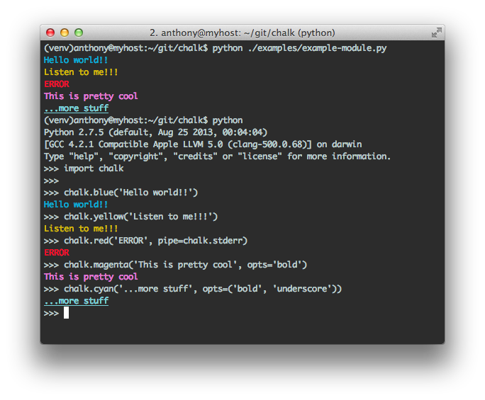
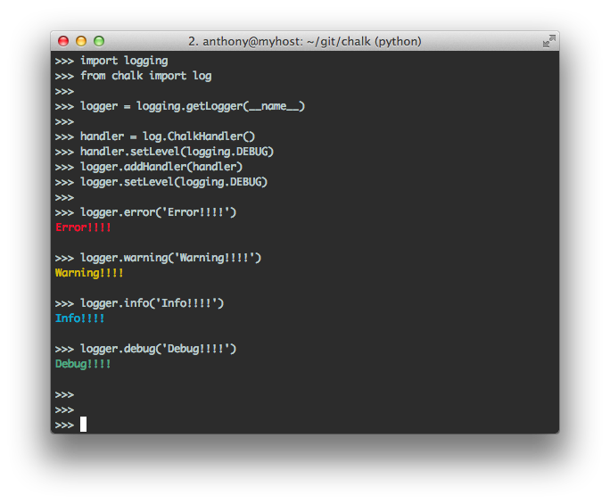

chalk [](https://travis-ci.org/anthonyalmarza/chalk)
=====


####*A Light-weight python package for terminal output in color*

*"Color printing so easy, makes you wanna smack yo' momma."*

**Overview**

Chalk allows you to print to your terminal in color. It also provides a simple
`logging` handler and formatter for a more informative logging experience.
Why print in black and white?

**Installation:**

    pip install pychalk


**In Module Usage:**

[`examples/example-module.py`](examples/example-module.py)




**Logging:**

[`examples/example-log.py`](examples/example-log.py)




**Testing:**


```
$ git clone https://github.com/anthonyalmarza/chalk.git
$ cd chalk
$ vitrualenv venv --no-site-packages --distribute
$ source venv/bin/activate
$ pip install tox
$ tox
GLOB sdist-make: /home/anthony/git/chalk/setup.py
py27 inst-nodeps: /home/anthony/git/chalk/.tox/dist/pychalk-1.1.0.zip
py27 installed: coverage==4.0.3,pychalk==1.1.0,six==1.10.0,Twisted==16.1.1,zope.interface==4.1.3
py27 runtests: PYTHONHASHSEED='458406004'
py27 runtests: commands[0] | coverage run --branch /home/anthony/git/chalk/.tox/py27/bin/trial chalk.tests
chalk.tests
  TestChalk
    test_availability_of_stdout_and_stderr ...                             [OK]
    test_colors ...                                                        [OK]
    test_existance_of_needed_functions ...                                 [OK]
    test_format_txt_accepts_bytes ...                                      [OK]
    test_format_txt_accepts_unicode ...                                    [OK]
    test_formats ...                                                       [OK]
    test_make_code_basic_use ...                                           [OK]
    test_make_code_with_opts ...                                           [OK]

-------------------------------------------------------------------------------
Ran 8 tests in 0.034s

PASSED (successes=8)
py27 runtests: commands[1] | coverage report -m
Name                        Stmts   Miss Branch BrPart  Cover   Missing
-----------------------------------------------------------------------
chalk/__init__.py              52      7     15      4    84%   45, 59, 70, 78-79, 93-94, 44->-44, 44->45, 48->50, 58->59
chalk/contrib/__init__.py       0      0      0      0   100%
chalk/contrib/django.py         3      3      0      0     0%   1-12
chalk/log.py                   34     34     12      0     0%   1-52
chalk/utils.py                  1      1      0      0     0%   2
-----------------------------------------------------------------------
TOTAL                          90     45     27      4    48%
___________________________________ summary ____________________________________
  py27: commands succeeded
  congratulations :)

```


**Big-ups**

* @billjohnston
* @livibetter
